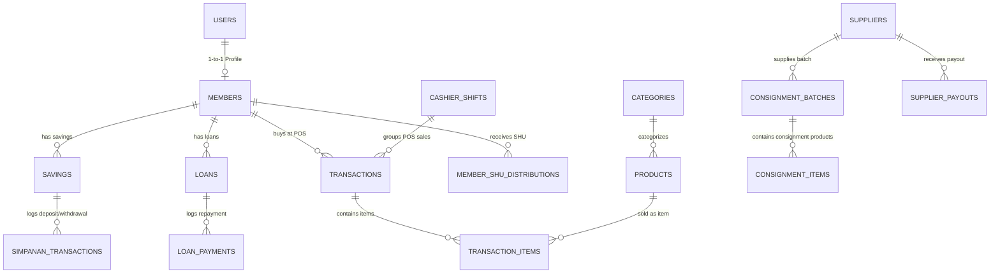

# ERD & Key Entity Relationships

High-level overview of primary relationships across core tables in **Koperasi Bermadani**.

---

## 🔗 Key Foreign Key Mappings

---

## 📌 Core Domain Connection Rules

1. **Member -> POS & Simpan Pinjam**:
   - `Member` is the central pivot. A POS transaction linked to a `member_id` automatically accumulates points logged in `MemberPointsHistory`.
   - Savings (`savings`) are divided by type (`simpanan_pokok`, `simpanan_wajib`, `simpanan_sukarela`).

2. **Minimarket POS -> Accounting**:
   - When a `Transaction` completes, `TransactionItem`s deduct `Product` stock via `StockMovement`.
   - Payment totals generate a `FinancialTransaction` ledger entry for bookkeeping.

3. **Consignment & Payouts**:
   - Products from `Supplier` belong to a `ConsignmentBatch`. When sold at POS, payout calculations link `TransactionItem` -> `ConsignmentItem` -> `SupplierPayout`.

---

## 🔗 Related Notes
- [[schema_summary|Database Schema Summary]]
- [[00_OVERVIEW|System Overview]]
